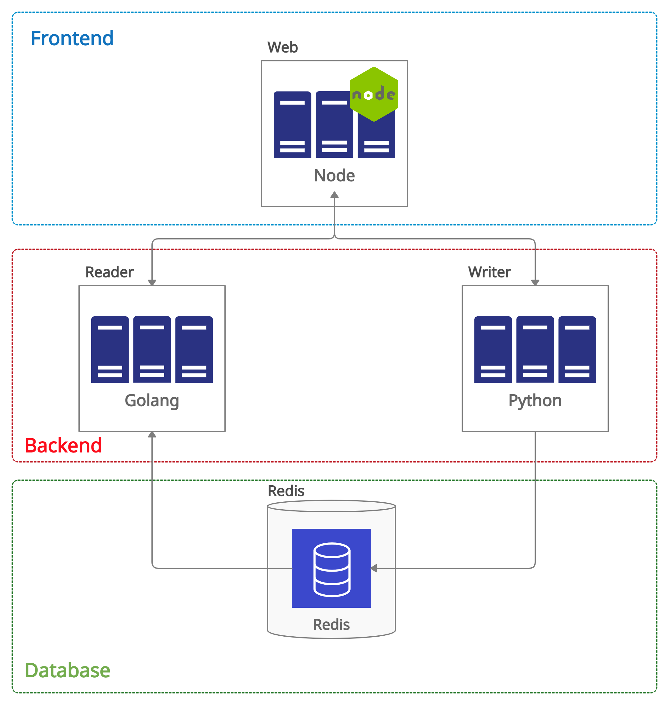

# Descrição das Atividades e Raciocínios
## Lógica Utilizada

A estratégia utilizada foi de executar o Compose e analisar os _logs_ que eram gerados, observando os erros que apareceriam, tanto no log da IDE quanto no browser, e corrigindo-os em seguida. 

## Etapas do processo
### - Build Compose

O primeiro problema detectado foi com o Compose, o mesmo não estava _buildando_. Observei os arquivos relacionados, como docker-compose.yml e Dockerfile, encontrando erros na escrita dos arquivos.

Realizando as devidas alterações, consegui executar o Compose e construir a aplicação com base no arquivo YAML.

Com a aplicação construída, observei que os serviços estavam _down_ e analisei novamente o arquivo Dockerfile e docker-compose a fim de identificar se as portas estavam corretas. Detectei que estavam invertidas (entre reader e writer) e que o redis não estava com a porta definida, corrigi o arquivo docker-compose e o serviço _writer_ se tornou _up_.

### - Executar os Serviços

Após uma análise mais geral da aplicação, executei os serviços independentementes: Web, Reader, Writer e Redis. Notei alguns pontos:

1. O serviço Reader não estava _up_;
2. O serviço Writer estava com falhas, segundo o log;
3. A conexão com o banco Redis estava falhando;
4. A criação do serviço Redis estava incorreta, sendo nomeado de _reidis_ ao invés de _redis_.

Com isso, decidi focar em cada serviço para torná-los funcionais.

#### > Reader
Ajustei o Dockerfile, adicionando comandos (RUN) para que os módulos necessários fossem instalados no container. Além disso era necessário a criação do arquivo _go.mod_. Seguindo a documentação disponibilizada pelo Docker, alterei o comando CMD, trocando por ENTRYPOINT como sugerido. Feito as alterações, foi possível construir e executar a aplicação _main.go_. 

Uma leve alteração foi necessária no arquivo _main.go_, ao construir a aplicação detectei uma falha no _log_ referente a um erro no código. Realizei o reparo e ao construir novamente o _container_ foi criado com sucesso.

#### > Writer
As alterações foram menores. O arquivo _requirements.txt_ foi criado para adicionar o módulo redis ao arquivo _main.py_. Este foi criado de forma manual e executado no containers por meio do _pip_. Além disso foi alterado o comando CMD e ENTRYPOINT, mantendo apenas o CMD como sugere a documentação.

#### > Redis
A criação do Redis não teve tanto problema, exceto por um erro na nomeação do serviço, que foi resolvido em um primeiro momento no arquivo _docker-compose-yml_

#### > Web
O serviço web não sofreu alterações, não vi necessidade de modificar para que o serviço fosse executado com sucesso.

### - Estabelecendo a Comunicação entre os serviços

Com todos os serviços funcionando de forma individual foi o momento de executar o Compose e analisar se todos estariam executando e interagindo em si. No _Home_ da aplicação foi apresentado que os serviços estavam _up_ e ao testar obtive sucesso, concluindo que a aplicação, de forma geral, estava funcionando normalmente.

## Observações

1. Bug encontrado no arquivo main.go;
2. Uso de volumes para os serviços;
3. Organização de Networks no Compose;
4. Atenção para um _warning_ ao levantar o serviço reader, referente ao golang.

## Arquitetura 

